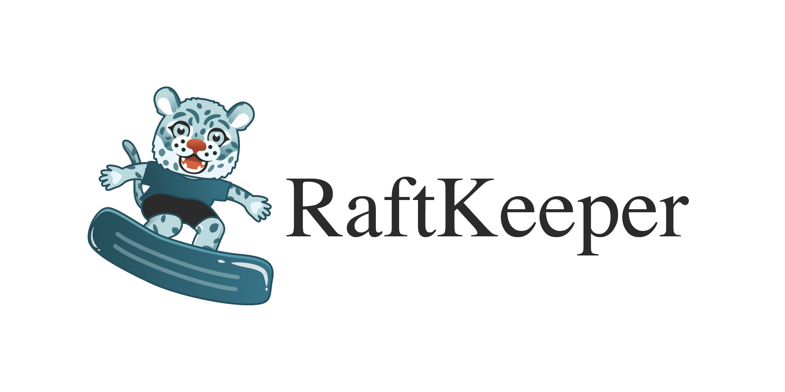

RaftKeeper is a high-performance distributed consensus service. 
It is fully compatible with Zookeeper and can be accessed through the Zookeeper 
client. It implements most of the functions of Zookeeper (except: Container node, 
TTL node, quota etc.) and provides some additional functions, such as more 
monitoring indicators, manual Leader switching and so on. 

RaftKeeper provides same consistency guarantee:
1. Responses must be returned in order in one session.
2. All committed write requests must be handled in order, across all sessions.

RaftKeeper data resides in memory and provides snapshot + operation log data 
persistence capabilities. The execution framework adopts pipeline and batch 
execution methods to greatly improve system throughput.

The main features of RaftKeeper are its performance and query stability. 
1. It provides a throughput that is twice as high as Zookeeper
2. TP99 is smoother than Zookeeper

See [benchmark](benchmark%2FBenchmark.md) for details.

RaftKeeper is derived from [ClickHouse](https://github.com/ClickHouse/ClickHouse) 
and take [NuRaft](https://github.com/eBay/NuRaft) as Raft implementation. 
We really appreciate the excellent work of the ClickHouse and NuRaft team.


# How to start?

## 1. Build RaftKeeper

### Build on Ubuntu

Requirement: Ubuntu 20.04+, Clang 13+, Cmake 3.12+
```
# install tools
sudo apt-get install cmake llvm-13
 
# clone project
git clone https://github.com/JDRaftKeeper/RaftKeeper.git
git submodule sync && git submodule update --init --recursive
 
# build project
export CC=`which clang-13` CXX=`which clang++-13`
cd RaftKeeper && /bin/bash build.sh

# build for ClickHouse usage
cd RaftKeeper && /bin/bash build.sh 'clickhouse'
```

Now RaftKeeper support build on Linux and Mac OX, details see [how-to-build](docs%2Fhow-to-build.md)

## 2. Deploy RaftKeeper

To deploy a RaftKeeper cluster you can see [how-to-deploy](docs%2Fhow-to-deploy.md).

## 3. Access RaftKeeper

You can use ZooKeeper's shell client [zkCli.sh](https://zookeeper.apache.org/doc/r3.6.0/zookeeperCLI.html) 
to access to RaftKeeper, or you can use Java, python or C ZooKeeper clients to access. 
Also, RaftKeeper supports Zookeeper's [4lw command](https://zookeeper.apache.org/doc/r3.6.0/zookeeperAdmin.html#sc_zkCommands).

The following is a `zkCli.sh` demo

```
./zkCli.sh -server node1:8101
```

# How to migrate from Zookeeper?

RaftKeeper provides tool to translate Zookeeper data to RaftKeeper format. So you can 
simply move data into RaftKeeper, detail is in [how-to-migrate-from-zookeeper](docs%2Fhow-to-migrate-from-zookeeper.md).
