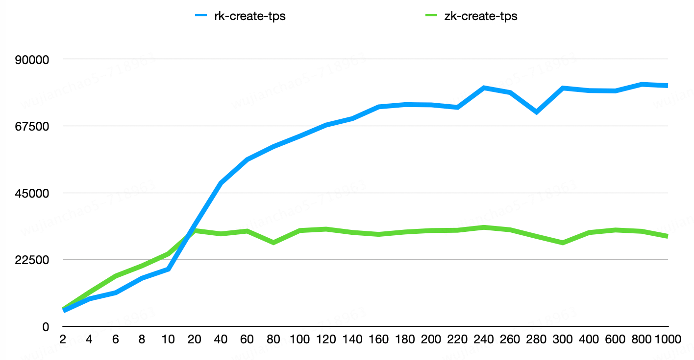
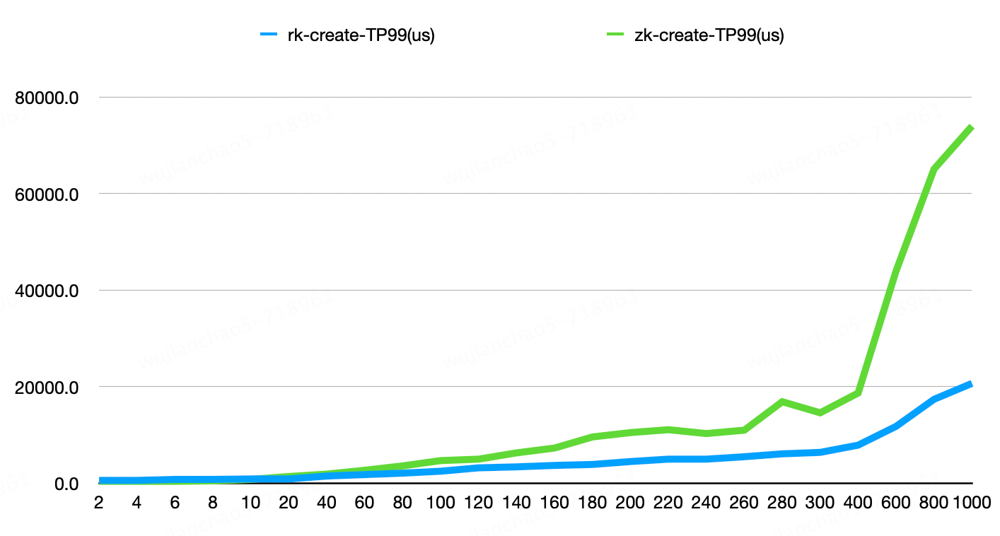
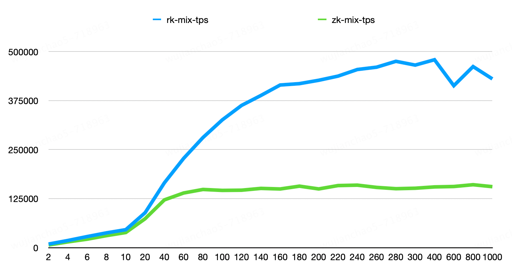
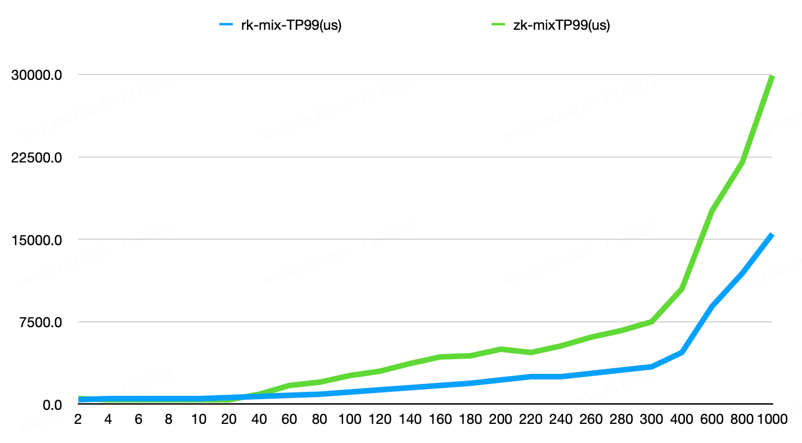

# RaftKeeper Benchmarks

You can use [raftkeeper-bench](https://github.com/JDRaftKeeper/raftkeeper-bench) to do benchmarking. Below we compare the performance of ZooKeeper and RaftKeeper.


## Environment

```
Server: Docker - 16 cores, 32GB memory, 100GB NVMe disk
System: CentOS 7.9
Version: RaftKeeper 2.1.0, ZooKeeper 3.7.1
Cluster: RaftKeeper 3 nodes, ZooKeeper 3 nodes
Config: default
```


## 1. Write request benchmark (create-100%)

- Create: every node value is 100 bytes






## 2. Mixed request benchmark (create-1% set-8% get-45% list-45% delete-1%)

- Create: every node value is 100 bytes
- Set: every node value is 100 bytes
- Get: node value is 100 bytes
- List: 100 children, every child 50 bytes
- Delete: delete the created nodes







## Summary

The TPS of RaftKeeper for create requests is 2.4 times that of ZooKeeper, 
and for mixed requests, it is 3 times that of ZooKeeper.
